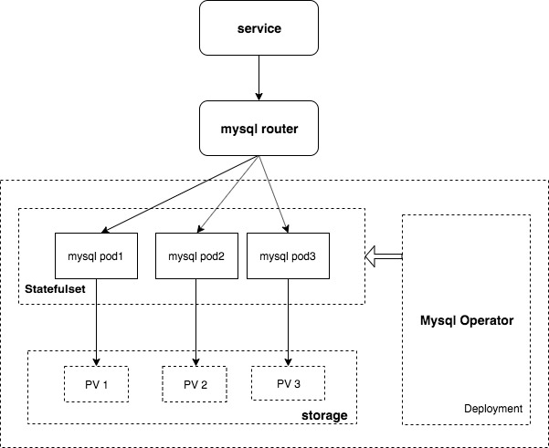

# BaaS

> 此项目用于管理 CaaS 平台上Mysql, Redis, Kafka 的集群实例，包含集群的创建，配置，服务暴露等，在部署此项目之前，请先部署好对应的 Operator

## Requirements

- openshift 3.11 +
- kubernetes 1.11 +
- Go 1.13.3

## mysql operator deployment

- 部署架构图

- 操作步骤如下：
1. 创建 mysql-operator namespace

        oc create ns mysql-operator
2. 部署 mysql operator

        oc create -f ./deployments/mysql-operator

## build management image

1. 在本地编译

        export GO111MODULE="on"
        export GOPROXY="https://goproxy.cn,direct"
        
        go build -o ./app ./cmd/main.go
2. build docker 镜像

        docker build -t dbaas:v1.0 .

## deploy management

        oc adm policy add-cluster-role-to-user cluster-admin -z default -n mysql-operator
        oc create -f ./deployments/dbaas.yaml